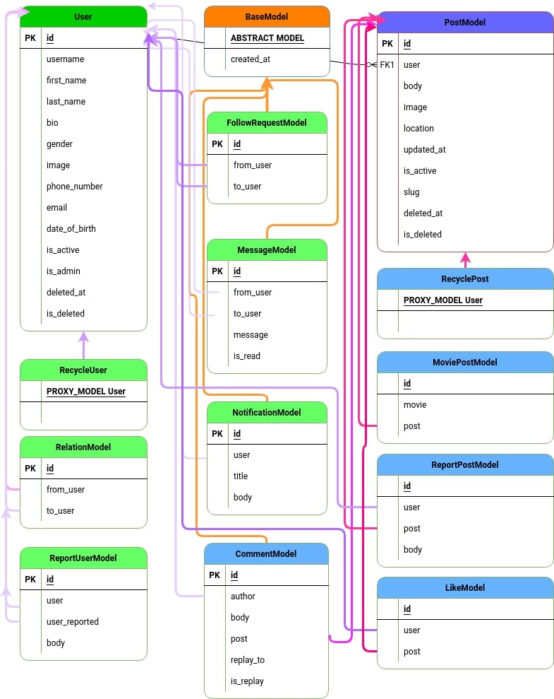

# Resonegram

Resonegram is a social media project that allows users to freely publish their posts, leave comments, and like other people's posts. It also provides a chat system for users to communicate with each other. Users can sign up for Resonegram using their Google or GitHub account, and the project includes a password recovery system.

## Table of Contents

- [Getting Started](#getting-started)
  - [ERD](#ERD)
  - [Prerequisites](#prerequisites)
  - [Installation](#installation)
- [Usage](#usage)
- [Contributing](#contributing)
- [License](#license)
- [Acknowledgements](#acknowledgements)

## Getting Started

This section should provide instructions on how to get started with the project. It should include any prerequisites that need to be installed, as well as instructions on how to install the project.

### ERD

  

### Prerequisites

Before installing Resonegram, make sure you have the following requirements:

    Python 3.8.x or higher
    Django 3.2.x or higher
    Other dependencies listed in the requirements.txt file

### Installation

To install Resonegram, follow these steps:

    1. Clone the repository to your local machine
    2. Create a virtual environment and activate it
    3. Install the dependencies using pip
    4. Run the migrations using python manage.py migrate
    5. Create a superuser account using python manage.py createsuperuser
    6. Run the development server using python manage.py runserver

## Usage

Once you have installed Resonegram, you can access it through your web browser at http://localhost:8000. From there, you can       sign up for an account, create posts, leave comments, like posts, and chat with other users.

## Contributing

If you would like to contribute to Resonegram, please read the CONTRIBUTING.md file for guidelines on how to do so.

## License

This project is licensed under the MIT License - see the LICENSE file for details.

## Acknowledgements

We would like to thank the following individuals and organizations for their contributions to Resonegram:
    
    Django
    Django-material-lite
    Google
    GitHub
    Alikomijani
    SepehrBazyar
    mongard
    
